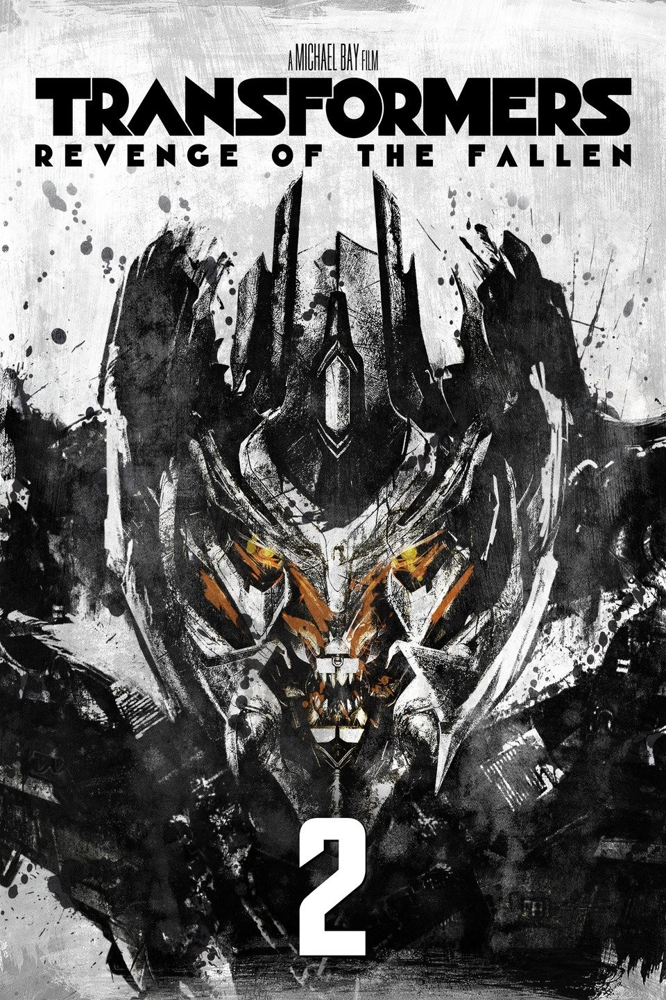

<!-- _class:
- lead -->

# Transformers 2

Frederick Vandermoeten

---
<!-- paginate: true -->
## Overview

- Multi-Head Attention
- Complete Transformer Model
- Cross-Attention
- Training
- Transformer Variants
- Optimizations

---
<!-- header: Multi-Head Attention -->

## Multi-Head Attention

- many Attention Heads in parallel create one Layer 
  $$\text{MultiHead}(Q, K, V) = \text{Concat}(\text{head}_1, ..., \text{head}_h)W^O$$
- each head uses a linear transformation on Q, K and V
  $$\text{head}_i = \text{Attention}(QW_i^Q, KW_i^K, VW_i^V)$$

---
<!-- header: Multi-Head Attention -->

## Ouput Matrix Splitting - Example GPT3

$$\text{MultiHead}(Q, K, V) = \text{Concat}(\text{head}_1, ..., \text{head}_h)W^O$$
$$\text{head}_i = \text{Attention}(QW_i^Q, KW_i^K, VW_i^V)$$

$d_{Embedding} = d_E = 12{\small,}288; d_{k} = 128$
$W^Q_i$ and $W^K_i \in \mathbb{R}^{d_{E} \times d_{k}}$
$d_{e} * d_{k} = 12{\small,}288 * 128 = 1{\small,}572{\small,}864$
$W^V_{i, pre} \in \mathbb{R}^{d_{E} \times d_{E}}$
$d_{e} * d_{e} = 12{\small,}288 * 12{\small,}288 = 150{\small,}994{\small,}944$

---
<!-- header: Multi-Head Attention -->

## Ouput Matrix Splitting - Example GPT3

$$\text{MultiHead}(Q, K, V) = \text{Concat}(\text{head}_1, ..., \text{head}_h)W^O$$
$$\text{head}_i = \text{Attention}(QW_i^Q, KW_i^K, VW_i^V)$$

$W^Q_i$ and $W^K_i \in \mathbb{R}^{d_{E} \times d_{k}}$
$d_{e} * d_{k} = 12{\small,}288 * 128 = 1{\small,}572{\small,}864$
$W^V_{i, pre} \in \mathbb{R}^{d_{E} \times d_{E}}$
$d_{e} * d_{e} = 12{\small,}288 * 12{\small,}288 = 150{\small,}994{\small,}944$
We split $W^V_{i, pre}$ into $W^V_i \in \mathbb{R}^{d_{E} \times d_{v}}$ and $W^O_i \in \mathbb{R}^{d_{v} \times d_{E}}$ with $W^V_{i, pre} = W^V_iW^O_i$
If we use $d_{v} = d_{k}$, we get the same amount of parameters for $W^V_i$ and $W^O_i$ as for $W^Q_i$ and $W^K_i$
$$W^O = \text{Vertcat}(W^O_1, ..., W^O_h)$$

---
<!-- header: Multi-Head Attention -->

## Multi-Head Attention 2

  

---
<!-- header: Complete Transformer Model -->

## Complete Transformer Model

- Encoder-Decoder architecture

- Embedding
- Positional Encoding
- Multi-Head Attention
- Feed Forward Network
- Skip Connections
- Layer Normalization
- Cross-Attention
  

---

<!-- header: Cross-Attention -->

## Cross-Attention

- Enables interaction between encoder and decoder
- Decoder uses encoder output as input
- Query comes from the decoder, key and value from the encoder
- Encoder and decoder could be from different modals (text, image, video)

[RAS2024](https://magazine.sebastianraschka.com/p/understanding-and-coding-self-attention) (modified)

---

<!-- header: Training -->

## Training

### Parallelization

- Unlike RNNs, no sequential dependencies between inputs
- Just a bunch of matrix multiplications that can be parallelized very well with modern hardware (GPUs, TPUs)
- We still get order information due to the positional encoding
- Efficient use of training data

---

<!-- header: Training -->

## Training: Example GPT-2 vs GPT-3

### GPT-2

- 1.5B parameters
- 40 Gb of data

### GPT-3

- 176B parameters
- 570 Gb of data

---

<!-- header: Transformer Variants -->

## Transformer Variants

Transformers were initially designed for NLP, but have since been applied to other tasks as well.

---

<!-- header: Applications -->

## Text Transformers

### GPT - Generative Pre-trained Transformer

- Decoder-only Transformer
- Used for text generation, summarization, question answering, etc.

### BERT - Bidirectional Encoder Representations from Transformers

- Encoder-only Transformer
- Used for text classification, sentiment analysis, etc.

### T5 - Text-to-Text Transfer Transformer

- Encoder-Decoder Transformer
- Less specialized so it needs fine-tuning, useful for e.g. translation

---

<!-- header: Applications -->

## Vision Transformers

### ViT - Vision Transformer

- Images are encoded in patches, then the patches are fed into the Transformer
- Self-Attention is used to learn the global relationships
- Used for image classification, object detection, etc.

### Stable Diffusion

- Diffusion models are encoder-decoder models that use noise for the hidden state
- Cross-Attention is used to integrate text prompts
- Used for image generation, image inpainting, etc.

---

<!-- header: Applications -->

## Audio Transformers

### Wav2Vec

- Operates directly on waveforms
- Speech recognition, especially for low-resource languages

### Audio Spectrogram Transformer

- Uses ViT on spectrograms
- Audio classification (genre, instrument, etc.), speech emotion recognition, etc.

---

<!-- header: Optimizations -->

## Optimizations

### Sparse Transformers

- Attention Layers grow $O(n^2)$ for the context size $n$
- most results of $\text{softmax}(\frac{Q^T K}{\sqrt d_{k}})$ are close to zero
- different ways to reduce the scaling by only considering close values or random feature attention

### Model Distillation

- Train a smaller, faster model with data generated by a larger, slower model
- Teacher/ Student Model

---

<!-- header: Conclusion -->

## Conclusion

- Transformers revolutionized NLP
- Attention is what drives their success
- They are versatile and can be used for many different tasks
- They scale well to large datasets
- Work in progress

---

<!-- header: Sources -->

## Image Sources

All not locally credited images are from [dvgodoy: Deep Learning Visuals](https://github.com/dvgodoy/dl-visuals) [CC BY](https://creativecommons.org/licenses/by/4.0/)

## Main Conceptual Sources

- [Vaswani, A. "Attention is all you need." Advances in Neural Information Processing Systems (2017).](https://arxiv.org/pdf/1706.03762)

- [Raschka: Understanding and coding self-attention](https://magazine.sebastianraschka.com/p/understanding-and-coding-self-attention)

- [3Blue1Brown: Neural Networks Playlist](https://www.youtube.com/playlist?list=PLZHQObOWTQDNU6R1_67000Dx_ZCJB-3pi)

- [SBert Wiki](https://sbert.net)